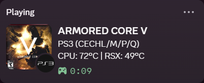
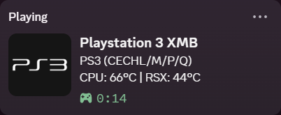
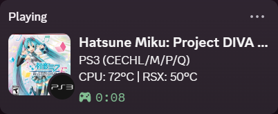
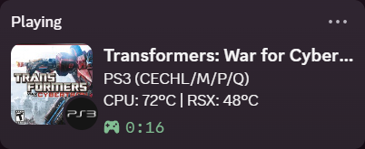

> ⚠️ **Warning:** This uses the **Discord User Gateway** and is therefore **against Discord’s Terms of Service**.
>
> Use this **at your own risk**. Discord may terminate accounts for this use; see its [policy on automated user accounts](https://support.discord.com/hc/en-us/articles/115002192352-Automated-User-Accounts-Self-Bots).

<p align="center">
  
</p>

<h1 align="center">PS3 Presence — Discord Rich Presence for PlayStation 3</h1>

<p align="center">Discord Rich Presence, directly from your PlayStation 3.</p>
<p align="center"><strong>Version 0.4.0 · Development build · CFW + Cobra</strong></p>

PS3 Presence brings Discord Rich Presence to your PlayStation 3, showing your game, cover art, console information, temperatures, and elapsed time. Everything runs on the PS3—no PC application is needed during play.

> Requires a PS3 running CFW with Cobra enabled and webMAN MOD installed. HEN is not currently supported.

<p align="center">
  <a href="https://github.com/Nyxnix/ps3-presence/releases/latest"><strong>Download latest release</strong></a> · <a href="#installation">Installation instructions</a>
</p>

<p align="center">
  
</p>

## ✨ Features

- **Console-only presence:** automatically updates when you launch a game or return to the XMB.
- **Game artwork:** looks up covers by title ID, with the PS3 wordmark as a fallback.
- **GameName layout:** game title, PS3 model family, CPU/RSX temperatures, and an advancing timer.
- **PS3 badge:** a small PS3 icon on game covers. Hover over the cover for the title ID or the badge for “PS3 Game.”
- **One XMB icon:** launch normally for configuration; hold L1 to install or update the plugin.
- **Live configuration:** edit your token and toggle presence from the console or through FTP.

## 🖼️ Display examples

| Activity | Discord presence |
| --- | --- |
| **XMB** |  |
| **Hatsune Miku: Project DIVA F 2nd** |  |
| **Transformers: War for Cybertron** |  |

## 🔧 Setup

### Requirements

- PS3 with **CFW and Cobra enabled**.
- [webMAN MOD](https://github.com/aldostools/webMAN-MOD) with its HTTP server running.
- An internet connection on the PS3.
- A Discord user-session token. A bot token or application client secret will not work.

### Installation

1. Download and extract the binary ZIP from [Releases](https://github.com/Nyxnix/ps3-presence/releases), then install `ps3-presence-installer.pkg` through the CFW Package Manager. See [Building](#building) to build from source.
2. In **Game**, hold **L1** while launching **PS3 Presence**. Keep holding it through the starting screen.
3. Wait for the installation-success message. The installer asks webMAN to restart the PS3 normally to activate the plugin.
4. Launch **PS3 Presence** normally, select **Token**, and enter your token.
5. Set **Presence** to **ON** and press **Circle** to return to the XMB.

The installer preserves your configuration and other startup plugins. To update, install the newer package and launch it while holding L1; it will restart automatically after installation succeeds. If automatic restart fails, restart the PS3 manually.

### Controls

| Button | Action |
| --- | --- |
| Up / Down | Select Token, Presence, or Uninstall |
| X | Choose the selected action |
| Circle | Exit the configuration app |
| Hold L1 during launch | Install or update the plugin |

Tokens are masked in the configuration screen. A new installation starts with presence OFF until you add a token and enable it.

To remove everything, select **Uninstall** and confirm with **X**; **Circle** cancels. This stops the plugin and removes its startup entries, saved token, settings, diagnostic files, and the app itself. Other apps and plugins are preserved. Cobra syscalls must be enabled for uninstall.

## ⚙️ Configuration

The console app and plugin share one file, which you can also edit through FTP:

```text
/dev_hdd0/tmp/ps3_presence.conf
```

| Setting | Purpose |
| --- | --- |
| `enabled` | `1` enables presence; `0` disables it |
| `token` | Your Discord user-session token |
| `show_xmb` | `1` shows XMB activity; `0` clears activity on the XMB |
| `status` | `online`, `idle`, `dnd`, or `invisible` |
| `application_id` | Discord application used for the presence |
| `large_image` / `small_image` | Default artwork and PS3 badge asset IDs |

Use the [example configuration](config/ps3_presence.conf.example) as a reference. Keep the default application and asset IDs unless you have configured your own Discord application.

Changes take effect while the plugin is running; reconnecting can take a few seconds. OFF clears activity and releases the TLS allocation while leaving the module loaded so you can turn it back on without restarting. Avoid saving from the app and uploading through FTP at the same time. Never include your token or configuration file in an issue report.

<details>
<summary>Installed files</summary>

| Path | Purpose |
| --- | --- |
| `/dev_hdd0/game/PS3RPC001` | Installer and configuration app |
| `/dev_hdd0/plugins/ps3_presence.sprx` | Resident presence plugin |
| `/dev_hdd0/boot_plugins.txt` | Cobra startup list; the installer adds one presence entry |
| `/dev_hdd0/tmp/ps3_presence.conf` | Configuration shared with FTP |

Configuration saves are validated and staged before replacement. A `.bak` file may be retained for rollback; it also contains the token.

</details>

## 🛠️ Troubleshooting

**Presence does not appear**

Check that Cobra and webMAN MOD are enabled, the PS3 is connected to the internet, and Presence is ON with a valid token. Restart after installing the plugin with L1. Also check Discord’s activity-sharing settings.

**The activity remains visible after turning presence OFF**

Discord can briefly retain an old activity card. Wait a few seconds, then close and reopen the profile card.

**A game shows the PS3 logo instead of its cover**

Cover lookup may have failed, or that title ID may not have artwork available. The PS3 logo is the fallback.

**The model shows several letters, such as CECHL/M/P/Q**

Those models share a platform ID. The plugin shows the known model group rather than guessing the exact model or regional suffix. Unknown hardware shows “PS3.”

## 📌 Limitations

- PS3 games and XMB are supported. PS1, PS2, PSP, and HEN support are not implemented.
- Game detection relies on webMAN MOD. Updates are sampled, so title changes are not instantaneous.
- Artwork availability depends on [GameTDB](https://www.gametdb.com/PS3) and Discord. Cover pixels are not cached on the PS3.
- This is a development build with limited hardware testing. Broader firmware compatibility and long-session stability still need testing.

<a id="building"></a>
## 🔨 Building

Install **PS3DEV/PSL1GHT**, **Python 3.12 or later**, and **Make**. The toolchain defaults to `/opt/ps3dev`; set `PS3DEV` and `PSL1GHT` for another location. Mbed TLS 3.6.6 is downloaded automatically and checked against its pinned checksum.

```sh
git clone https://github.com/Nyxnix/ps3-presence.git
cd ps3-presence
make all inspect
```

| Output | Purpose |
| --- | --- |
| `dist/ps3_presence.sprx` | Resident plugin |
| `dist/ps3-presence-installer.pkg` | Installable XMB app with the bundled plugin |

The required dependency, PRX packaging, and verification helpers are included under `tools/`. No proprietary Sony SDK is required.

`make all` builds both outputs. `make inspect` checks the plugin's PRX structure and relocations. `make clean` removes generated files from `build/` and `dist/`, keeping downloaded dependencies for the next build.

Diagnostic logs, state snapshots, and stack sampling are disabled by default. To build with them enabled, use `make DIAGNOSTICS=1 all inspect`. Diagnostic files are written under `/dev_hdd0/tmp/ps3_presence*`; returning to `make all inspect` disables them again.

## 🐞 Issues

[Open an issue](https://github.com/Nyxnix/ps3-presence/issues) with your firmware, Cobra/webMAN versions, game title ID, and steps to reproduce the problem. Remove credentials and personal identifiers before attaching diagnostic output.

## 🙌 Credits

- [XeCord](https://github.com/UncreativeXenon/XeCord) by UncreativeXenon — inspiration for standalone console presence and the small platform badge.
- [PS3-Rich-Presence-for-Discord](https://github.com/zorua98741/PS3-Rich-Presence-for-Discord) by zorua98741 — inspiration for the GameName presentation.
- [PS3DEV / PSL1GHT](https://github.com/ps3dev/PSL1GHT), [webMAN MOD](https://github.com/aldostools/webMAN-MOD), [Mbed TLS](https://github.com/Mbed-TLS/mbedtls), and the PS3 development community.
- [GameTDB](https://www.gametdb.com/PS3) — game cover artwork.

## License

Project-authored code is [GPL-3.0-only](LICENSE). Third-party code and assets retain their own terms; see [third-party notices](licenses/THIRD_PARTY.txt). PlayStation trademarks belong to Sony. Game artwork and screenshot content are not covered by the project's GPL license.

Builds copy notices to `dist/licenses`. Distribute these alongside the installer and standalone plugin in the release ZIP, and provide access to the exact matching source and dependencies.
